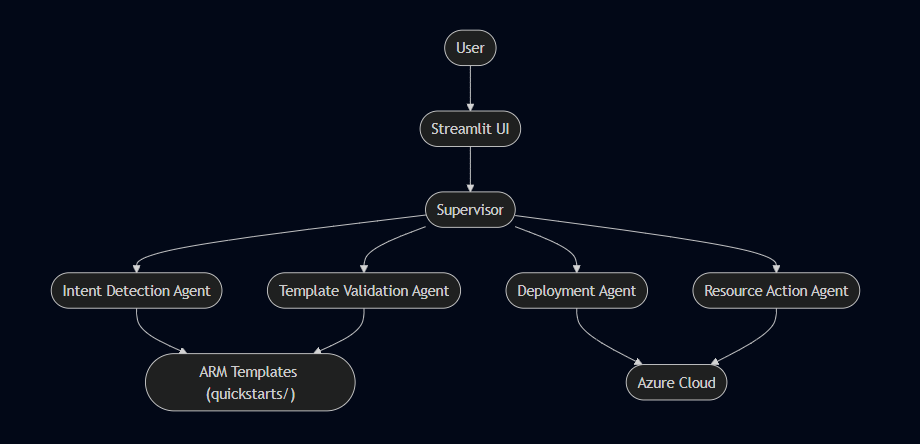
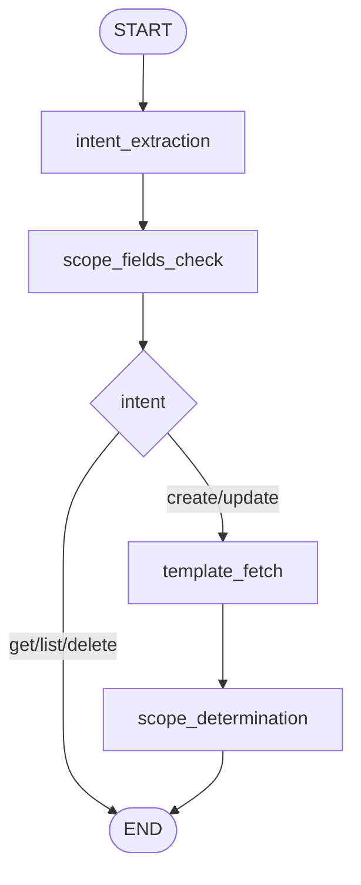
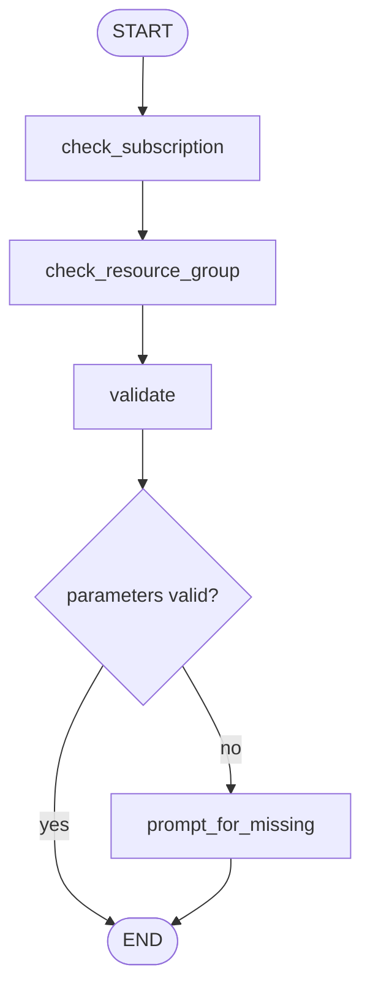
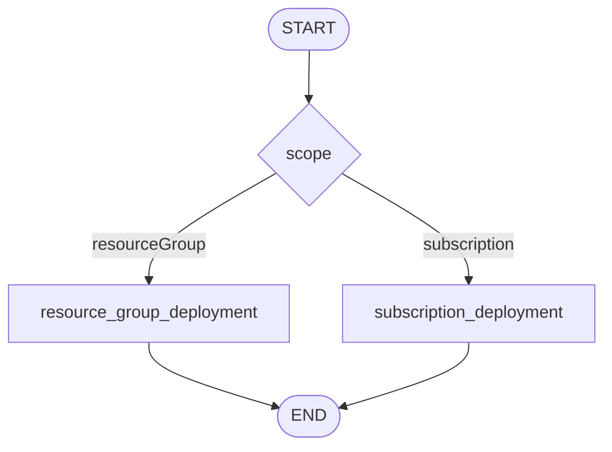
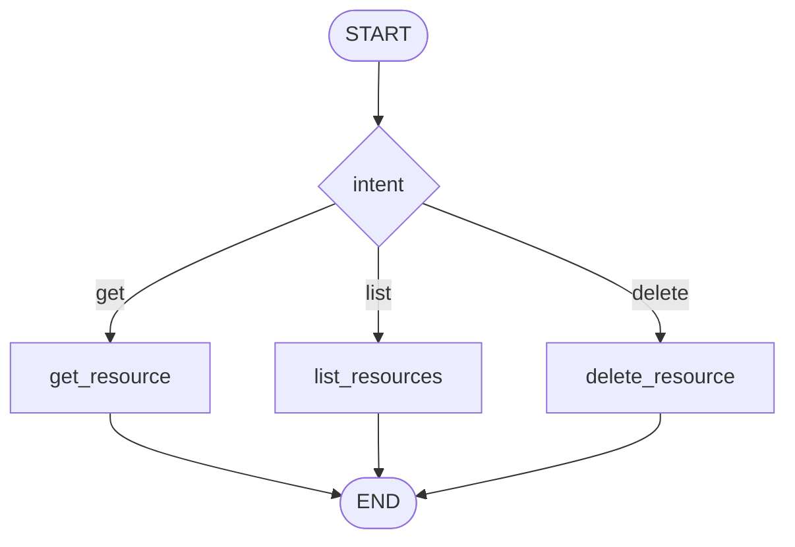
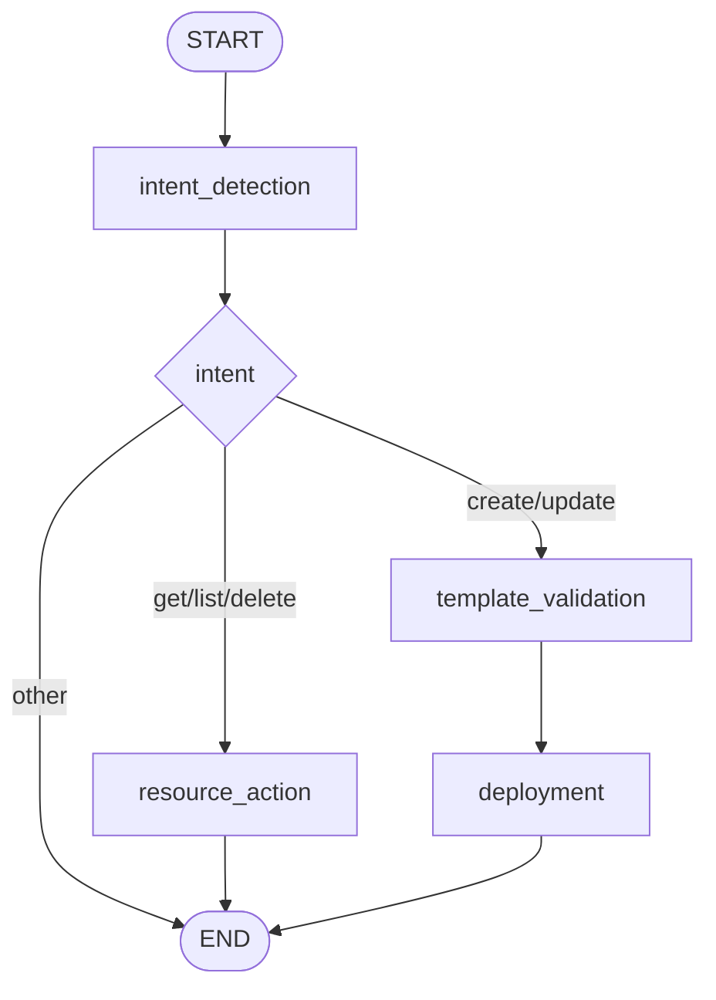

# Azure Resource Management Assistant (ARMA)

ARMA is a modular, multi-agent assistant for Azure resource provisioning, validation, and management, built with LangGraph and LangChain.

## Overview

Azure Resource Management Assistant (ARMA) provides a robust, streaming, and user-friendly workflow for managing Azure resources. It leverages a multi-agent architecture to extract user intent, validate ARM templates, and manage Azure resources, with all agent/system progress streamed to the UI.

## Features

- Modular, multi-agent workflow for Azure resource management
- Intent extraction, template validation, deployment, and resource action agents
- Real-time streaming of agent/system progress to the UI
- Human-in-the-loop support for missing or ambiguous fields
- Production-grade, extensible codebase using LangGraph and LangChain

## Architecture

ARMA is composed of several subgraphs/agents:

- **Intent Detection Agent**: Extracts user intent and resource details
- **Template Validation Agent**: Fetches and validates ARM templates
- **Deployment Agent**: Handles Azure deployments
- **Resource Action Agent**: Manages resource actions (create, update, delete, etc.)
- **Human Node**: Prompts for missing/unclear fields

All state and progress are logged for real-time UI display.



## Getting Started

1. Clone the repository
2. Install dependencies from `requirements.txt`
3. Run the main entry point (see usage examples in the codebase)

## Usage

- Interact with ARMA via the provided Streamlit or console harness
- All agent progress and system messages are streamed to the UI

---

## Table of Contents

- [Architecture](#architecture)
- [State Management](#state-management)
- [Agent & Subgraph Design](#agent--subgraph-design)
  - [Intent Detection Subgraph](#intent-detection-subgraph)
  - [Template Validation Subgraph](#template-validation-subgraph)
  - [Deployment Subgraph](#deployment-subgraph)
  - [Resource Action Agent](#resource-action-agent)
- [Main Graph Wiring](#main-graph-wiring)
- [Message Logging & UI Integration](#message-logging--ui-integration)
- [ARM Template Storage](#arm-template-storage)
- [How to Run](#how-to-run)
- [Extending the System](#extending-the-system)
- [File Structure](#file-structure)
- [Appendix: Example Conversation Flow](#appendix-example-conversation-flow)
- [Work In Progress (WIP)](#work-in-progress-wip)

---

## Architecture

The workflow is composed of three main subgraphs (agents), each responsible for a distinct phase of the Azure provisioning process:

1. **Intent Detection**: Extracts user intent, resource type, and relevant fields from natural language.
2. **Template Validation**: Validates user-provided fields against ARM template requirements.
3. **Deployment**: Deploys the validated template to Azure, handling both resource group and subscription scopes.

These subgraphs are orchestrated by a **master graph** (see implementation in the main app), which manages the overall workflow and state transitions.

---

## State Management

All conversational and workflow state is managed via a single, strongly-typed state object (`ARMAState` in `state.py`). This state includes:

- `messages`: **Full conversation history** (user, agent, and system/progress messages)
- `intent`, `resource_type`, `provided_fields`, `resource_group_name`, `subscription_id`, `subscription_name`, `location`
- `template`, `scope`, `parameter_file_content`, `validation_error`, `deployment_status`, etc.

**All user and agent/system interactions are logged in the `messages` list**, ensuring the UI can display the complete conversation and agent progress in real time.

---

## Agent & Subgraph Design

### 1. Intent Detection Subgraph (`agents/intent_agent.py`)

**Purpose:**
Extracts the user's intent, Azure resource type, and all relevant fields from the user's natural language input.

**Nodes:**

- `intent_extraction`: Uses an LLM (Azure OpenAI) to extract intent, resource type, and fields.
- `scope_fields_check`: Ensures required fields (resource group, subscription) are present; interrupts if missing.
- `template_fetch`: Loads the correct ARM template based on resource type.
- `scope_determination`: Determines deployment scope (resource group, subscription, etc.) from the template schema.

**Flow:**



**Key Features:**

- Uses a detailed system prompt with examples for robust extraction.
- Handles edge cases (e.g., GUID vs. name for subscription).
- Interrupts and prompts user if required fields are missing.

---

### 2. Template Validation Subgraph (`agents/validation_agent.py`)

**Purpose:**
Validates that all required ARM template parameters are provided and correct, using both code and LLM-based validation.

**Nodes:**

- `check_subscription`: Verifies the Azure subscription exists and is enabled.
- `check_resource_group`: Verifies the resource group exists in the subscription.
- `validate`: Uses an LLM to check provided fields against template parameters, types, and allowed values.
- `prompt_for_missing`: Interrupts and prompts the user for any missing or invalid parameters.

**Flow:**



**Key Features:**

- LLM intelligently maps user fields to template parameters.
- Handles type checking, allowed values, and extra fields.
- Prompts user for missing/invalid parameters.

---

### 3. Deployment Subgraph (`agents/deployment_agent.py`)

**Purpose:**
Deploys the validated ARM template to Azure, handling both resource group and subscription-level deployments.

**Nodes:**

- `resource_group_deployment`: Deploys to a resource group (creates it if needed).
- `subscription_deployment`: Deploys at the subscription scope.

**Flow:**



**Key Features:**

- Uses Azure SDK for Python for deployments.
- Handles resource group creation if missing.
- Logs deployment status and errors.

---

### 4. Resource Action Agent (`agents/resource_action_agent.py`)

**Purpose:**
Handles Azure resource management actions such as get, list, and delete for resources, using the Azure SDK.

**Nodes:**

- `get_resource`: Retrieves details of a specific Azure resource.
- `list_resources`: Lists resources of a specified type in a resource group.
- `delete_resource`: Deletes a specified Azure resource.

**Flow:**



**Key Features:**

- Uses Azure SDK for Python for all resource actions.
- Logs and stores all results in the workflow state in a consistent, JSON-formatted way.
- Handles missing required fields by interrupting and prompting for user input.
- Supports extensible intent-based routing for future resource actions.

---

## Main Graph Wiring

The **master graph** orchestrates the full workflow by chaining the subgraphs:



- Each subgraph is compiled and added as a node.
- State is passed between subgraphs, with all messages and progress logged.
- Interrupts (e.g., missing fields) are handled gracefully, prompting the user as needed.

---

## Message Logging & UI Integration

- **All user, agent, and system/progress messages are appended to the `messages` list in the state.**
- The UI (e.g., `streamlit_app.py`) displays the full conversation, including agent/system progress and interruptions.
- The Streamlit app formats and displays all messages, updating in real time as the workflow progresses.

**Example UI flow:**

1. User submits a request (e.g., "create a storage account...").
2. Each agent/subgraph appends progress/system messages (e.g., "Extracting intent...", "Validating template...").
3. If user input is needed, the system interrupts and prompts for missing fields.
4. All messages are shown in the chat interface, providing full transparency.

---

## ARM Template Storage

- ARM templates are stored in the `quickstarts/` directory, organized by resource type (e.g., `quickstarts/microsoft.storage/storageaccounts.json`).
- The intent detection agent dynamically loads the correct template based on the extracted resource type.

---

## How to Run

1. **Install dependencies:**
   ```
   pip install -r requirements.txt
   ```

2. **Set up environment variables:**
    ```
    # Your AI Foundry project chat model
    AZURE_OPENAI_ENDPOINT=
    AZURE_OPENAI_DEPLOYMENT=gpt-4o
    AZURE_OPENAI_API_VERSION=2024-12-01-preview

    LANGCHAIN_TRACE_V2=False

    LANGSMITH_TRACING=true
    LANGSMITH_API_KEY=
    LANGSMITH_ENDPOINT=https://api.smith.langchain.com

    # Azure DefaultCredentials
    AZURE_CLIENT_ID=
    AZURE_TENANT_ID=
    AZURE_CLIENT_SECRET=
    ```

3. **Run the Streamlit app:**
   ```
   python streamlit_app.py
   ```

4. **Interact with the assistant:**
   - Enter natural language requests (e.g., "create a storage account named test in rg demo").
   - The UI will display all agent/system progress and prompt for any missing information.

---

## Extending the System

- **Add new resource types:**
  Add new ARM templates to the `quickstarts/` directory.
- **Add new agents/subgraphs:**
  Create new agent modules in `agents/` and wire them into the main application logic.
- **Customize validation or deployment logic:**
  Edit the relevant agent node functions for custom business logic or additional checks.
- **Prompts and Factories:**
  - Add or update prompt templates in the `prompts/` directory.
  - Use the `factory/` directory for shared construction logic or utilities.

---

## File Structure

```
.
├── agents/                  # All agent implementations (intent, validation, deployment, resource actions)
│   ├── __init__.py
│   ├── intent_agent.py
│   ├── validation_agent.py
│   ├── deployment_agent.py
│   └── resource_action_agent.py
├── factory/                 # Shared factory functions/utilities
├── prompts/                 # Prompt templates for LLMs
├── quickstarts/             # ARM templates organized by resource type
│   ├── microsoft.storage/
│   └── microsoft.keyvault/
├── .env                     # Environment variables
├── arma.py                  # Main application logic (entry point)
├── events_handler.py        # Event handling logic
├── state.py                 # State management and schemas
├── streamlit_app.py         # Streamlit UI
├── requirements.txt         # Python dependencies
├── README.md                # Project documentation
└── ...
```

- **agents/**: Contains all agent logic for intent extraction, validation, deployment, and resource actions.
- **factory/**: Shared construction logic, factories, or utilities for agents and other components.
- **prompts/**: Prompt templates for LLMs, organized by use case or agent.
- **quickstarts/**: ARM templates for supported Azure resources, organized by provider/type.
- **arma.py**: Main entry point for the application logic.
- **events_handler.py**: Handles event streaming and logging.
- **state.py**: Defines the ARMAState and manages workflow state.
- **streamlit_app.py**: Streamlit-based UI for interacting with ARMA.

---

## Appendix: Example Conversation Flow

## Example 1

**User:**
`create a storage account with the following values, name: aiteststorg01, rg: myrg, subscription: 00000000-0000-0000-0000-000000000000 and region eastus`

## Example 2

**User:**
`delete storage account with the following values, name: aiteststorg01, rg: myrg, subscription: 00000000-0000-0000-0000-000000000000`

## Example 3

**User:**
`list all storage accounts in the rg: myrg, subscription: 00000000-0000-0000-0000-000000000000`

**If missing fields:**

We use LangGraph's `Interrupt` to interrupt the workflow and prompt the user for the missing fields.

**All of the above messages are logged in the `messages` list and displayed in the UI.**

---

## Work In Progress (WIP)

### 1. Loading Templates from a Vector Store

Currently, ARM templates are loaded from the local file system based on the extracted `resource_type` (e.g., `quickstarts/microsoft.storage/storageaccounts.json`).

**Planned Improvement:**

- Store ARM templates in a vector store (e.g., FAISS, ChromaDB) with metadata including resource type, description, and tags.
- On intent extraction, use the resource type to query the vector store for the most relevant template, enabling fuzzy matching, semantic search, and easier extensibility.
- This will allow for more flexible template retrieval, support for similar resource types, and easier management of a large template library.

**Intended Approach:**

- Index all templates in the vector store at startup or via a management script.
- On user request, extract the resource type and use it as a query to the vector store.
- Retrieve the best-matching template and load it into the workflow state for validation and deployment.

### 2. Notification Agent

- Add a notification agent that sends a notification to the user when deployment is complete. It will contain deployment details.
- This will allow for more flexible notification, support for different notification types (e.g., email, SMS, Azure DevOps, Teams), and easier management of a large notification library.